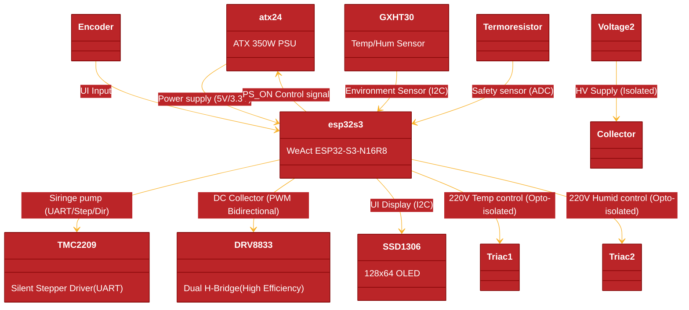

# Electrospinning Device Based on ESP32-S3

## Hardware Architecture & Component Analysis

Key Components Diagram

## Components Details

- Power supply 350W : ATX24 
- Stepper motor driver performance up to 35V and ± 1A, motors in fuji, half, 1/4, 1/8, and 1/16 step modes : A4988 
- Temperature and humidity sensor : GXHT30
- Push button encoder : Encoder
- LCD display : SSD1306
- Thermistor : Termoresistor
- Temperature control BTA24 220V : Triac1
- Humidity control BTA24 220V : Triac2
- DC 2-10V 1.5A motor driver : L298N
- 12V : Voltage
- High voltage power supply : Voltage2

--- 
# Components Details & PIN Compatibility (Fallbacks)
## MCU
### WeAct Studio ESP32-S3

* ESP32-S3-N16R8 (WeAct Studio)
	+ Main: WeAct Studio ESP32-S3 (16MB Flash / 8MB PSRAM)
	+ Fallback 1: ESP32-S3-DevKitC-1 (Full size, compatible pinout for most GPIOs)
	+ Fallback 2: Waveshare ESP32-S3-N8R2 (Same core, check mounting holes)

## Stepper Driver
### TMC2209 (Syringe Pump)

* TMC2209 (Ultra-silent, UART control for current/StallGuard)
	+ Fallback (Pin/Logic Compatible): TMC2208: Same pins, but lacks StallGuard (sensorless homing)
	+ Fallback (Pin/Logic Compatible): TMC2225: Similar performance, different package but often available on same-pinout modules
	+ Note: UART communication is essential for real-time current adjustment to prevent motor overheating

## DC Motor Driver
### DRV8833 (Collector)

* DRV8833 (Dual H-Bridge, MOSFET based)
	+ Why: Replaces L298N because it doesn't need a heatsink and supports low voltage (2V-10V) with high efficiency
	+ Fallback (Logic Compatible): TB6612FNG: Identical logic (IN1, IN2, PWM), very efficient
	+ Fallback (Logic Compatible): MAX1508: For very small DC motors, low heat

## Environmental Sensor
### GXHT30

* GXHT30 (I2C)
	+ Fallback (I2C / Software Compatible): SHT30 / SHT31: The industry standard, identical I2C registers
	+ Fallback (I2C / Software Compatible): SHT40: Newer generation, lower power, same I2C bus

## Display
### SSD1306 OLED

* SSD1306 (128x64, I2C)
	+ Fallback (I2C Compatible): SH1106: 1.3" OLED, requires a minor offset change in Zephyr dts
	+ Fallback (I2C Compatible): SSD1309: 2.4" Large OLED for better visibility in the lab

## AC Control
### BTA24 + MOC3041

* BTA24 (25A Triac) + MOC3041 (Zero-cross Opto)
	+ Fallback (Safety Compatible): MOC3063: Higher isolation voltage
	+ Fallback (Safety Compatible): BTA41: If higher current (40A) is needed for heavy heating elements

## PIN Mapping Analysis (ESP32-S3 WeAct)

To ensure the TMC2209 UART and other peripherals don't conflict:

| Peripheral | PIN Function | GPIO | Logic Type |
| --- | --- | --- | --- |  
| I2C Bus | SDA / SCL | 17/18 | Shared (Sensors + Display) |
| TMC2209 | UART TX / RX | 15 / 16 | Serial Config | 
| TMC2209 | STEP / DIR | 41 / 42 | High-speed Pulse | 
| DRV8833 | PWM / IN1 / IN2 | 4, 5, 6 | Motor Speed/Dir | 
| ATX24 | PS_ON | 7 | Power Control | 
| Encoder | A / B / SW | 1, 2, 3 | UI Navigation | 
| Triacs | Trigger 1 / 2 | 39 / 40 | AC Switching | 
| Thermistor | ADC Input | 10 | Analog Temp | 
