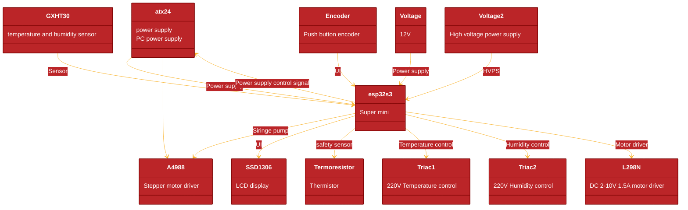

# Electrospinning-device based on ESP32 S3 Hardware arhitecture

## Key components

## Components Details

- Power supply 350W : ATX24 
- Stepper motor driver performance up to 35V and ± 1A, motors in fuji, half, 1/4, 1/8, and 1/16 step modes : A4988 
- Temperature and humidity sensor : GXHT30
- Push button encoder : Encoder
- LCD display : SSD1306
- Thermistor : Termoresistor
- Temperature control BTA24 220V : Triac1
- Humidity control BTA24 220V : Triac2
- DC 2-10V 1.5A motor driver : L298N
- 12V : Voltage
- High voltage power supply : Voltage2

--- 

### ATX24 vs ATX20 Connector

The ATX24 connector has 24 pins, while the ATX20 connector has 20 pins. The ATX24 connector is more powerful and has more pins, so it can provide more power to the board.

### MCU ESP32 S3

[MCU product link](https://aliexpress.ru/item/1005006963045909.html?spm=a2g2w.orderdetail.0.0.351d4aa6wwZoYd&sku_id=12000051721448206)

- [Features](https://www.waveshare.com/esp32-s3-zero.htm):
  - Processor
    * Xtensa 32-bit LX7 dual-core processor, up to 240MHz main frequency
  - Connectivity
    * 2.4GHz Wi-Fi (802.11 b/g/n)
    * Bluetooth 5 (LE)
  - Memory
    * 512KB of Static RAM
    * 384KB ROM
    * Options for 4MB Flash memory with 2MB PSRAM
    * Options for 8MB Flash memory with 8MB PSRAM
  - Power Management
    * Flexible clock
    * Module power supply independent setting
    * Other controls to realize low power consumption in different scenarios
  - Peripherals
    * Integrated with USB serial port full-speed controller
    * 24 GPIO pins allow flexibly configuring pin functions
    * 4 SPI
    * 2 I2C
    * 3 UART
    * 2 I2S
    * 2 ADC

### A4988 Stepper Motor Driver

[Product link](https://aliexpress.ru/item/1005009631015158.html?spm=a2g2w.detail.rcmdprod.1.78d77e49YpZeLY&mixer_rcmd_bucket_id=controlRu2&pdp_trigger_item_id=0_32459985724&ru_algo_pv_id=1915a3-ea9d81-da89e4-725abe-1774090800&scenario=aerSimilarItemByContentRcmd&sku_id=12000049687640900&traffic_source=recommendation&type_rcmd=core)

- Overview
  - The A4988 DMOS Microstepping Driver with Translator and Overcurrent Protection is a breakout board for Allegro s A4988. Please read the A4988 datasheet carefully before using this product.

- Features
  - Operate bipolar stepper motors in full-, half-, quarter-, eighth-, and sixteenth-step modes
  - Output drive capacity of up to 35 V and 2 A
  - Translator for easy implementation

- Interface
  - The translator is the key to the easy implementation of the A4988. Simply inputting one pulse on the STEP input drives the motor one microstep.
  - No phase sequence tables, high-frequency control lines, or complex interfaces to program.
  - The A4988 interface is an ideal fit for applications where a complex microprocessor is unavailable or is overburdened.

### SSD1306 LCD Display

[SSD1306 product link](https://aliexpress.ru/item/32957309383.html?spm=a2g2w.orderdetail.0.0.74a14aa6qxLJFp&sku_id=10000002492059222)

- I2C interface
- 128x64 resolution
- 1.3V to 3.6V operation
- 3.3V to 5.5V operation
- 2 colors (black and white) or (black and yellow)

### GXHT30 Temperature and Humidity Sensor

[product link](https://aliexpress.ru/item/1005009122748907.html?sku_id=12000047992699924&spm=a2g2w.productlist.search_results.7.cca8f948fRnMkY)

- Humidity measurement range
- Humidity measurement
- Temperature measurement range: -40—1250C
- Temperature measurement accuracy
- Operating voltage: 2.2—5.5VDC(wide voltage)
- Size: 12x12 mm

### DC motor driver L298N

[product link](https://aliexpress.ru/item/1005005658579242.html?sku_id=12000033917792211&spm=a2g2w.productlist.search_results.1.25d065183CWPrE)

2.5A power-enhanced motor drive module with silicone line, pin, terminal, whose power supply voltage can be 2V ~ 10V, and it can drive two DC motors or a 4-wire 2-phase stepper motor, also can achieve positive and negative Turn and speed function with thermal protection and can automatically restore.

- Product Highlights:
  1. Imported original professional motor drive chip, builting-in low-conduction internal resistance MOS switch, heat is minimal, no heat sink, energy saving, is your ideal choice when you use battery as power supply.
  (L298N internal transistor switch, low efficiency, high fever, need to heat, bulky, the market is very easy to burn the L298N, are not using the original chip, this product can be replaced.

  2. Dual 2.5A x 2, is more power than 1.5A motor-driven version. With built-in thermal protection circuit, do not worry about the motor stall burned, the temperature automatically after the recovery. (Currently on the market of intelligent car voltage and current are in this range)
  3. Small size, light weight, 0 standby current.

- Specifications:
  1. module supply voltage: 2V-10V.
  2. Signal input voltage: 1.8-7V.
  3. Single Operating current: 2.5A;
  4. Standby current: less than 0.1uA.
  5. The mounting hole diameter: 2mm.
  6. Product Size:3.3 * 3.1 * 0.5cm/1.3*1.22*1.97inch
  7. Built-in common conduction circuit, when the input pin is left floating, the motor does not malfunction.
  8. Built-in thermal protection circuit with hysteresis effects (TSD), without worrying about motor stall.

## First view of the project

- [Project Homepage Link]( https://oshwlab.com/creciunelcatalin/esp-electrospinning)
- [Open in Editor Project Link](https://easyeda.com/editor#project_id=5543cd4c7d524438b3cbe7d184eac1cf)