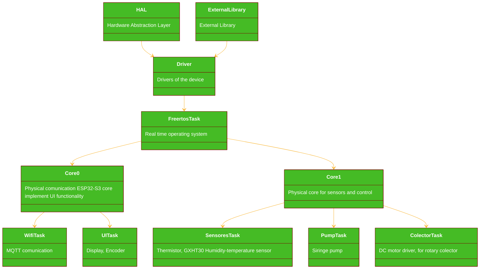

# Software Architecture

PlatformIO Project Structure using FREERTOS Operating System

Architecture of the Electrospinning-device based on ESP32 S3 describe the task for each component of the device. And the interaction between the components.

* the project shuld be layed to provide easy integration of new components and functionality
* use paralell tasks for better performance
* implement the stack and heap memory analisis of the device 
* use the previus defined web platform to provide an easy access for the user

## Extra features
 * upload the code to the ESP32-S3 via OTA 
 * set the pump speed and direction with the encoder
 * set the pump flow RPM
 * set the pump flow mL/min
 * Set the Colector speed
 * provide a menu for the user (with the encoder and dislaplay)