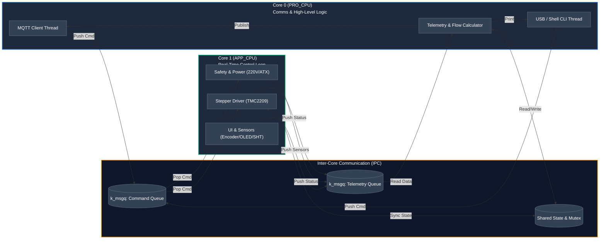

# Electrospinning Device Controller Firmware

Control software for automated electrospinning equipment based on ESP32-S3 MCU running Zephyr RTOS.

## Development Environment Setup

Activate the Zephyr virtual environment and environment variables:

```bash
source ~/zephyrproject/.venv/bin/activate
source ~/zephyrproject/zephyr/zephyr-env.sh
```

Build firmware for WeAct ESP32-S3 board:

```bash
west build -b weact_esp32s3_b/esp32s3/procpu
```

Flash firmware to target device:

```bash
west flash
```

## System Architecture

The software utilizes Zephyr's SMP (Symmetric Multiprocessing) capabilities across both ESP32-S3 Xtensa cores (PRO_CPU / Core 0 and APP_CPU / Core 1). Threads are strictly pinned to specific cores to guarantee deterministic real-time control for motors and safety while handling non-deterministic networking tasks separately.



## Core Allocation Strategy

- Core 0 (PRO_CPU): Connectivity & Logic
  - MQTT Task: andles Wi-Fi connection, subscribes to control topics, and publishes periodic telemetry payloads.
  - USB CLI Task: Real-time console interface via USB CDC-ACM for local calibration and configuration.
  - Telemetry & Volume Calculator: Computes total dispensed syringe volume ($V = \pi \cdot r^2 \cdot h$), linear flow rate ($\text{mL/h}$), elapsed operation time, and formats outgoing data buffers.
  
- Core 1 (APP_CPU): Hard Real-Time Execution
 - Stepper Motor Task: High-priority execution loop generating STEP/DIR pulse timing for TMC2209 drivers, acceleration profiles, and limit switch monitoring.
 - Safety & Power Control Task: Direct control of PS_ON (ATX24 power supply activation), monitoring Power Good (PG_F), and driving 220V Triac optocouplers.
 - Display & Human Interface: Periodic sampling of SHT30 sensor via I2C, reading rotary encoder quadratures, and driving the SSD1306 OLED screen.